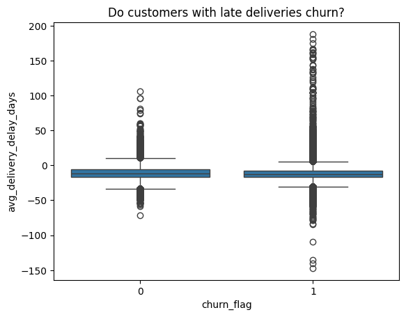
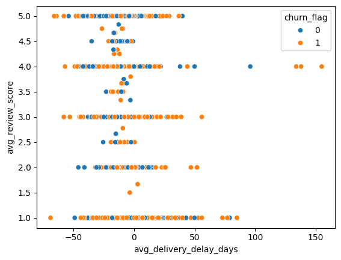
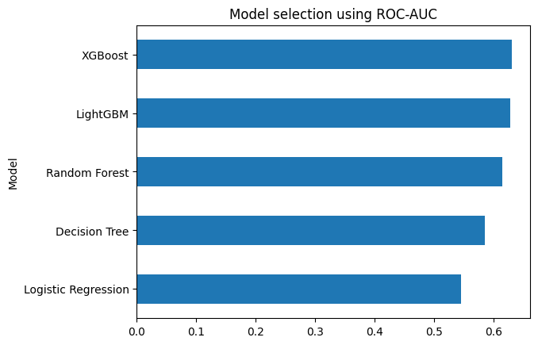
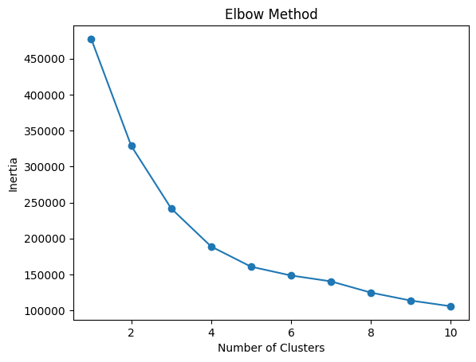
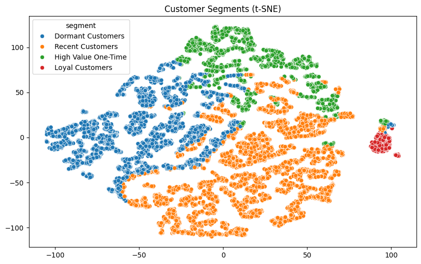

# Churn and Marketing Analytics

## Project Overview

This project analyzes customer behavior using the Olist e-commerce dataset. The objective is twofold:

1. Identify factors associated with customer churn.
2. Segment customers into meaningful groups to support personalized marketing strategies.

The project combines SQL, Python, exploratory data analysis, machine learning, and customer segmentation techniques.

---

## Tools and Technologies

- Python
- Pandas
- NumPy
- Scikit-Learn
- XGBoost
- PostgreSQL
- SQLAlchemy
- Matplotlib
- Seaborn

---

## Data Extraction

Data was extracted from a PostgreSQL database using SQL queries and loaded into Python for analysis.

The extraction process was performed through SQL scripts stored in the `Script_SQL` folder and executed using SQLAlchemy.

---

# Customer Churn Analysis

## Business Question

Can customer churn be explained by delivery performance, customer satisfaction, or purchasing behavior?

### Hypotheses

1. Do customers with late deliveries churn?
2. Do low review scores increase churn?
3. Do states with worse delivery times have lower retention?
4. Do premium customers tolerate more delays?
5. Does purchase frequency affect satisfaction?

## Key Findings

The analysis revealed that most variables showed very similar distributions between active customers and churned customers.

Key observations:

- Customers with delayed deliveries did not exhibit significantly higher churn rates.
- Customers receiving orders on time or earlier also churned at similar rates.
- Geographic delivery performance showed limited association with churn.
- Premium customers did not demonstrate a clear tolerance for delivery delays.
- Purchase frequency showed weak relationships with customer satisfaction.

Customers receiving delayed orders did not exhibit significantly higher churn rates.

Among all investigated factors, review scores provided the strongest signal, although the relationship was still relatively weak. Customers with review scores of 3 or below showed a slightly higher tendency to churn.

## Machine Learning Models

The following models were evaluated:

- Logistic Regression
- Decision Tree
- Random Forest
- LightGBM
- XGBoost

### Final Model Selection

XGBoost was selected as the final model.

Although Logistic Regression achieved the highest Recall and F1 Score, it showed very poor class discrimination capability and classified most customers as churned.

XGBoost achieved the highest ROC-AUC score (0.630), providing the best balance between churn detection and class separation.

---

# Customer Classification

## Business Objective

Understand customer purchasing behavior in order to develop personalized marketing strategies.

## Methodology

Customer segmentation was performed using K-Means clustering.

The optimal number of clusters was evaluated using:

- Elbow Method
- Silhouette Score

Although K=2 achieved the highest Silhouette Score, K=4 was selected because it produced more interpretable and actionable business segments.

## Customer Segments

The model identified four customer groups:

- Loyal Customers
- Recent Customers
- Dormant Customers
- High Value One-Time Customers

### Key Findings

The Loyal Customers segment showed the clearest separation from the remaining groups, indicating stronger purchasing consistency and customer retention.

The remaining segments exhibited partial overlap, suggesting that customer behavior exists on a continuum rather than in completely isolated categories.

## Dataset Limitation

One important limitation of the Olist dataset is that approximately 90% of customers placed only one order. This restricts the ability to analyze long-term customer behavior and limits the predictive power of churn-related features.