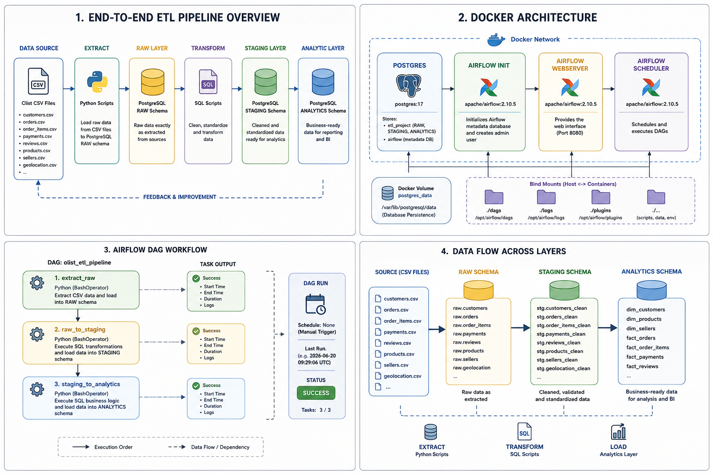

# Data Engineering Lab – Olist ETL Pipeline

## Project Overview

This project demonstrates the design and implementation of an end-to-end ETL pipeline using Docker, PostgreSQL, Python, SQL, and Apache Airflow.

The objective is to extract raw e-commerce data from the Olist dataset, transform and organize it through multiple database layers, and automate the entire workflow using Airflow orchestration.

The project follows a modern Data Engineering architecture with:

- Dockerized PostgreSQL database
- Layered data model (RAW, STAGING, ANALYTICS)
- Python-based ETL processes
- SQL transformation scripts
- Apache Airflow orchestration
- Environment variable management
- Reproducible Linux-compatible file structure

The final result is a fully automated pipeline capable of loading, transforming, and preparing analytical datasets for reporting and business intelligence purposes.

## General architecture

             
## Docker Architecture

The solution is deployed using Docker containers.

## PostgreSQL Container

Responsible for storing:

- RAW data
- STAGING data
- ANALYTICS data
- Airflow metadata database

## Airflow Components

### 1. Airflow Scheduler
- *Schedules and executes pipeline tasks.*

### 2. Airflow Webserver
- *Provides the web-based monitoring interface.*

### 3. Airflow Init
- *Initializes the Airflow metadata database and creates administrative users.*

### 4. Persistent Storage
- *Docker volumes are used to ensure database persistence across container restarts.*

## ETL Workflow

### 1. Extract

Python scripts load CSV files into the PostgreSQL RAW schema.

Tables loaded include:

- Customers
- Orders
- Order Items
- Payments
- Reviews
- Products
- Sellers
- Geolocation

### 2. Transform

SQL scripts clean, standardize, and enrich raw data.

Operations include:

- Data validation
- Column standardization
- Business rule implementation
- Relationship creation

### 3. Load

Processed data is loaded into the ANALYTICS schema where it becomes available for reporting and downstream analytics.

