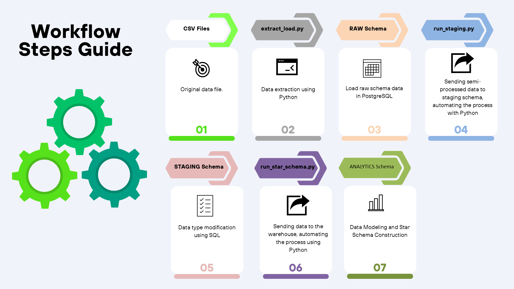
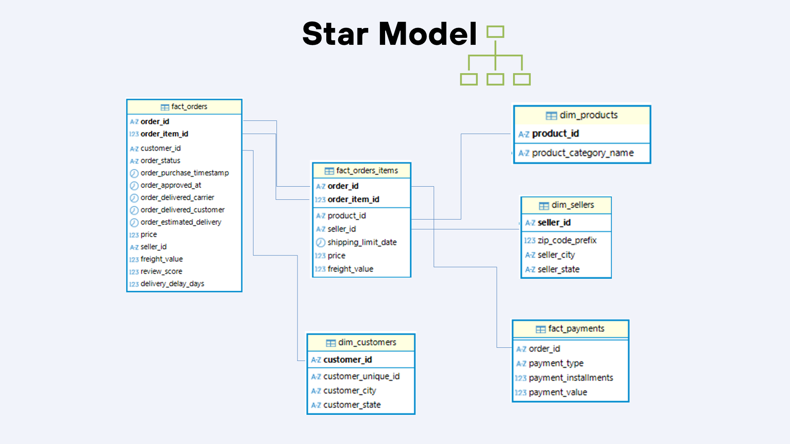
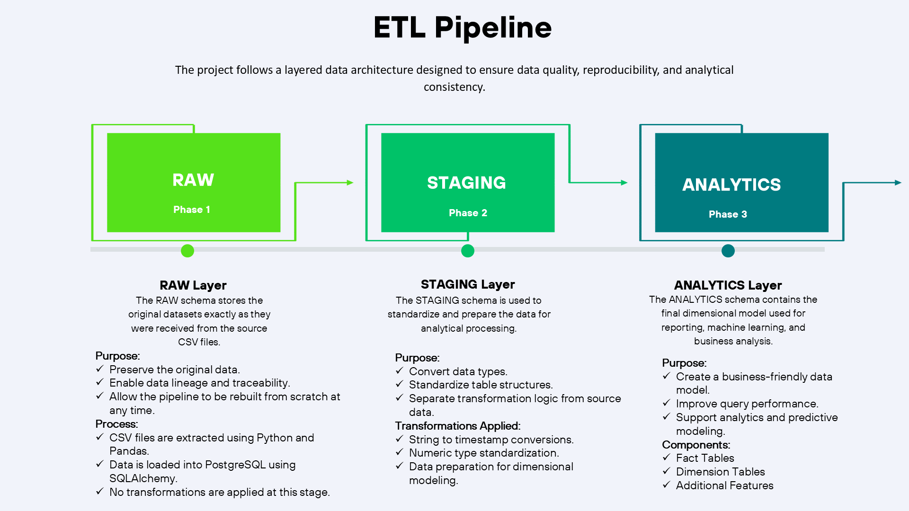
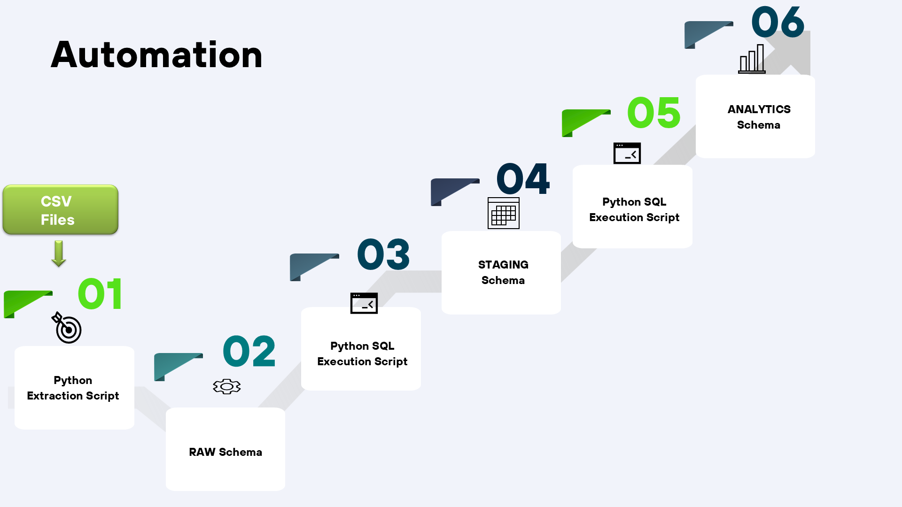

# ETL Process

## Project Overview

This project focuses on designing and implementing a scalable analytics pipeline for e-commerce data.

The workflow begins with extracting multiple CSV datasets using Python and loading them into PostgreSQL. The data is then transformed through a layered architecture consisting of RAW, STAGING, and ANALYTICS schemas. A dimensional model was created using fact and dimension tables, including primary and foreign key relationships to support analytical workloads.

The resulting analytical environment serves as the foundation for exploratory analysis, machine learning models, and business intelligence reporting.

## Workflow Steps Guide

## Star Model Diagram

## Description of the layers

To ensure reproducibility, Python scripts were developed to automate each stage of the pipeline.

# Conclusion

This project demonstrates the complete lifecycle of an analytics solution, from raw data ingestion to advanced analytical modeling.

A multi-layer PostgreSQL architecture was designed using RAW, STAGING, and ANALYTICS schemas to ensure data quality, reproducibility, and scalability. Automated ETL pipelines were developed using Python and SQL, enabling the systematic transformation of source data into a structured dimensional model.

The resulting data warehouse served as the foundation for multiple analytical initiatives, including customer churn analysis, customer segmentation, logistics performance evaluation, regression modeling, and classification models.

Through this project, key competencies were applied across data engineering, data modeling, SQL development, machine learning, and business analytics, providing an end-to-end view of how data can be transformed into actionable insights.
