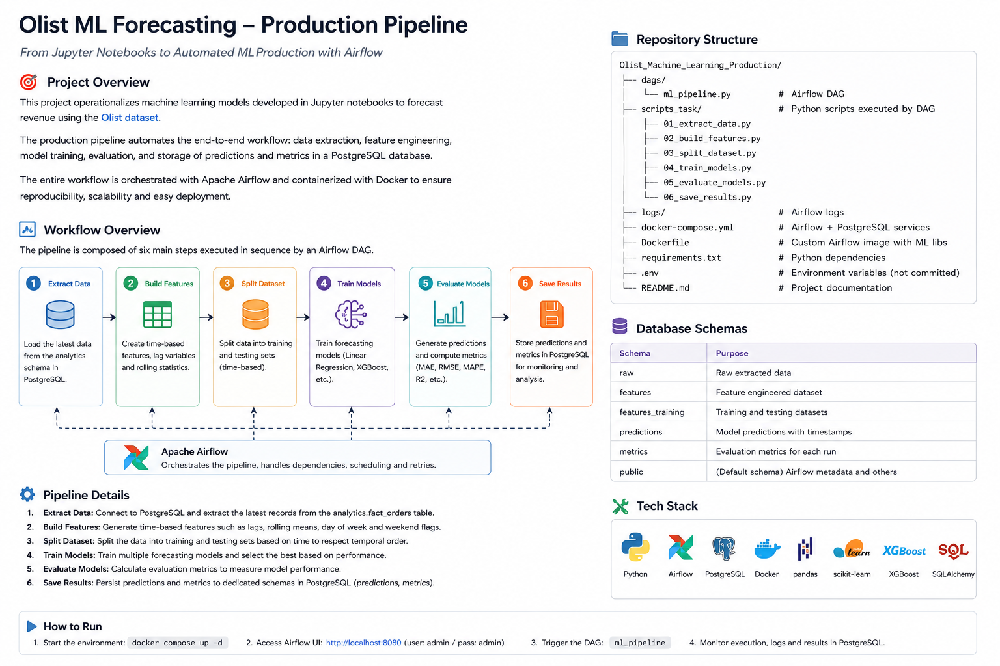

# End-to-End MLOps Pipeline with Model Orchestration and Monitoring

### The following image explains the stages that the Machine Learning models went through, for their continuous monitoring when they receive new data.

