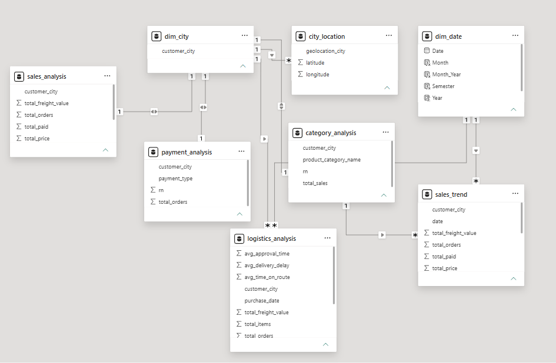
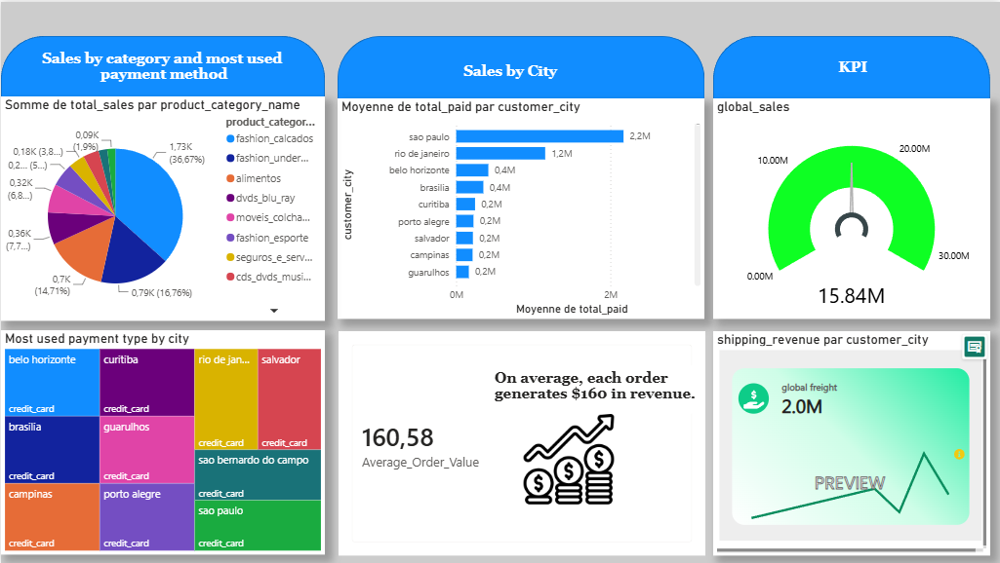

# Project Objective

The objective of this project is to analyze Olist's business performance, identifying the cities that generate the highest revenue, the most profitable product categories, and the most frequently used payment methods by customers. The analysis aims to transform transactional data into actionable information to support business decision-making.

## Data architecture

The data was extracted from PostgreSQL using Power BI's native connection in Import mode with custom SQL queries (Advanced Options).

Before being consumed by Power BI, the data was transformed and modeled in PostgreSQL to reduce model complexity and optimize the performance of the visualizations.

A star schema was then built in Power BI using fact tables and dimensions, enabling the correct propagation of filters and multidimensional analysis of the information.

# Sales Analysis Dashboard

## Figure 1. Sales Analysis Dashboard

*This dashboard provides an overview of the platform's sales performance through five main areas of analysis:*

## 1. Sales by Category

Identifies the product categories that generate the most revenue, allowing you to detect segments with high demand and growth opportunities.

## 2. Sales by City

Shows the cities with the highest sales volume, allowing you to identify the most relevant markets for the company.

## 3. Most Used Payment Method by City

Allows you to analyze the payment methods preferred by customers in each city, facilitating an understanding of purchasing behavior.

## 4. KPI Overview

Includes key performance indicators:

- Global Sales
- Shipping Revenue
- Average Order Value (AOV)

These indicators allow you to quickly evaluate the overall sales performance of the business.

## 5. Average Order Value

Measures the average revenue generated by each purchase order.

This analysis shows that each order generates approximately $160.58 in revenue, providing a useful benchmark for evaluating the average transaction value.

## Key Findings

The analysis revealed the following:

São Paulo is the platform's main market and accounts for the majority of revenue.
Fashion-related categories represent a significant share of total sales.
Credit card use is predominant in the main cities analyzed.
The average order value exceeds $160, reflecting a relatively high average order value for an e-commerce platform.

