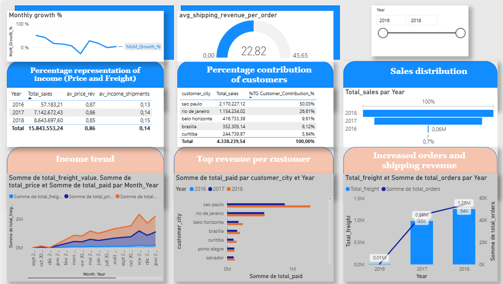
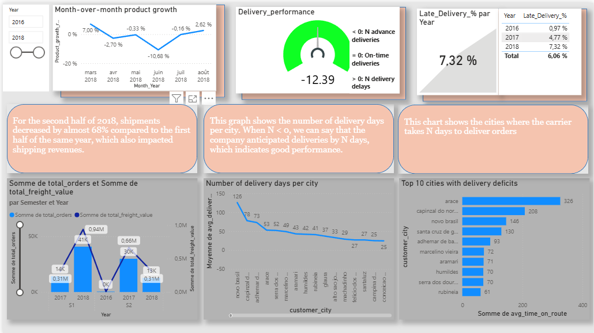

# Project Objective

The objective of this project is to analyze Olist's business performance, identifying the cities that generate the highest revenue, the most profitable product categories, and the most frequently used payment methods by customers. The analysis aims to transform transactional data into actionable information to support business decision-making.

## Data architecture

The data was extracted from PostgreSQL using Power BI's native connection in Import mode with custom SQL queries (Advanced Options).

Before being consumed by Power BI, the data was transformed and modeled in PostgreSQL to reduce model complexity and optimize the performance of the visualizations.

A star schema was then built in Power BI using fact tables and dimensions, enabling the correct propagation of filters and multidimensional analysis of the information.

# Sales Analysis Dashboard

## Figure 1. Sales Analysis Dashboard

*This dashboard provides an overview of the platform's sales performance through five main areas of analysis:*

## 1. Sales by Category

Identifies the product categories that generate the most revenue, allowing you to detect segments with high demand and growth opportunities.

## 2. Sales by City

Shows the cities with the highest sales volume, allowing you to identify the most relevant markets for the company.

## 3. Most Used Payment Method by City

Allows you to analyze the payment methods preferred by customers in each city, facilitating an understanding of purchasing behavior.

## 4. KPI Overview

Includes key performance indicators:

- Global Sales
- Shipping Revenue
- Average Order Value (AOV)

These indicators allow you to quickly evaluate the overall sales performance of the business.

## 5. Average Order Value

Measures the average revenue generated by each purchase order.

This analysis shows that each order generates approximately $160.58 in revenue, providing a useful benchmark for evaluating the average transaction value.

## Key Findings

The analysis revealed the following:

São Paulo is the platform's main market and accounts for the majority of revenue.
Fashion-related categories represent a significant share of total sales.
Credit card use is predominant in the main cities analyzed.
The average order value exceeds $160, reflecting a relatively high average order value for an e-commerce platform.

# Sales Trend Analysis

## Objective

The objective of this dashboard is to analyze the evolution of Olist's sales performance over time by monitoring revenue growth, customer contribution, shipping revenue, and order volume. The analysis helps identify sales trends, measure business growth, and understand how different customers and periods contribute to overall revenue generation.

## Dashboard Overview

## Figure 2. Sales Trend Analysis Dashboard

*This dashboard focuses on temporal analysis and performance monitoring through several key indicators and trend visualizations.*

## Key Metrics and DAX Measures

## Month-over-Month Sales Growth

This KPI measures the percentage change in sales compared to the previous month.

DAx:
MoM_Growth_% =
VAR Sales_current_month = [Total_sales]
VAR Sales_previous_month =
    CALCULATE(
        [Total_sales],
        PREVIOUSMONTH(dim_date[Date])
    )
RETURN
    DIVIDE(
        Sales_current_month - Sales_previous_month,
        Sales_previous_month
    )
*This metric allows stakeholders to quickly identify periods of growth or decline and evaluate short-term sales performance*

## Customer Revenue Contribution

This measure calculates the percentage contribution of each customer city to total revenue.

DAX:
Customer_Contribution_% =
DIVIDE(
    [Total_sales],
    CALCULATE(
        [Total_sales],
        ALL(sales_trend[customer_city])
    )
)
*The metric helps identify the most important markets and quantify their impact on overall business performance.*

## Average Shipping Revenue per Order

Measures the average shipping income generated by each order.

This KPI provides insight into logistics-related revenue and helps evaluate the profitability of shipping operations.

## Dashboard Components

## Monthly Growth %

Displays the month-over-month growth rate of sales revenue, highlighting periods of expansion and contraction.

## Percentage Representation of Income

Shows the proportion of revenue generated from::
- Product sales
- Shipping fees

*This comparison helps understand the relative importance of logistics revenue versus product revenue.*

## Percentage Contribution of Customers

Identifies the cities contributing the highest share of total revenue.

The analysis revealed that São Paulo represents the largest revenue contributor, followed by Rio de Janeiro and Belo Horizonte.

## Sales Distribution

Illustrates how sales are distributed across the years included in the dataset.

## Income Trend

Tracks the evolution of:

- Total Revenue
- Product Revenue
- Shipping Revenue

allowing users to identify long-term growth patterns and seasonal variations.

## Top Revenue per Customer

Highlights the cities generating the highest revenue over time.

## Increased Orders and Shipping Revenue

Compares order volume and freight revenue by year, providing visibility into the relationship between sales activity and logistics income.

## Key Insights

The analysis revealed several important business trends:

1. Revenue increased consistently throughout the observed period.
2. Product revenue remains the primary source of income, while shipping revenue represents a smaller but stable    contribution.
3. São Paulo is the dominant revenue-generating market and contributes a significant share of total sales.
4. Order volume and freight revenue increased simultaneously, indicating business growth accompanied by higher logistics activity.
5. Monthly sales growth exhibits periods of volatility, emphasizing the importance of monitoring short-term performance indicators.

# Logistics Analysis

## Objective

The objective of this dashboard is to evaluate Olist's logistics performance by monitoring delivery efficiency, shipping revenue, delivery delays, transportation lead times, and operational workload. The analysis aims to identify bottlenecks in the delivery process, measure service quality, and support logistics planning through data-driven decision-making.

## Dashboard Overview

## Figure 3. Logistics Analysis Dashboard

*This dashboard focuses on operational performance and delivery management through key logistics indicators and trend analysis.*

## Key Metrics and DAX Measures

## Month-over-Month Product Growth

This KPI measures the monthly variation in the number of items processed by the logistics network.

DAX:
Product_growth_rate_% = 
VAR current_items = [Volume_items] 
VAR previous_items = CALCULATE( [Volume_items], PREVIOUSMONTH(dim_date[Date]) ) 
RETURN DIVIDE( current_items - previous_items, previous_items )

Monitoring item volume is essential for logistics planning because periods of increased demand may require additional workforce, transportation capacity, and inventory handling resources. By anticipating fluctuations in workload, organizations can maintain service levels and delivery performance.

## Delivery Performance

This KPI evaluates delivery reliability by comparing actual delivery dates against estimated delivery dates.

The indicator can be interpreted as follows:

- Negative values indicate deliveries completed ahead of schedule.
- Zero indicates on-time deliveries.
- Positive values indicate delayed deliveries.

## Late Delivery Percentage

Shows the proportion of delayed deliveries over total deliveries.

The analysis revealed that delayed deliveries increased over time, reaching approximately 7.32% in 2018.

## Dashboard Components

## Orders and Shipping Revenue

Compares order volume and freight revenue across years.

The visualization indicates that higher order volumes are accompanied by higher freight revenue, reflecting the direct relationship between logistics activity and transportation income.

## Number of Delivery Days per City

Displays the average delivery lead time by city.

Cities with longer delivery times may indicate operational inefficiencies, geographical constraints, or opportunities for logistics network optimization.

## Top 10 Cities with Delivery Deficits

The analysis revealed several operational trends:

- Delivery delays increased throughout the analyzed period, reaching more than 7% of total deliveries.
- Freight revenue grew alongside order volume, indicating increasing logistics activity.
- Significant differences exist in delivery lead times between cities, suggesting uneven service performance across regions.
- Monitoring product volume growth provides valuable insight for workforce planning and transportation capacity management.
- Despite periods of increased logistics demand, delivery performance remained largely within expected service levels, indicating an overall efficient logistics operation.

# Conclusion and Business Recommendations

This project combined SQL data modeling, Power BI data visualization, and business analysis to evaluate Olist's commercial and logistics performance from multiple perspectives.

The Sales Analysis dashboard revealed that revenue is highly concentrated in a small number of cities, with São Paulo emerging as the primary revenue-generating market. The analysis also identified the most profitable product categories and the dominant payment methods used by customers.

The Sales Trend dashboard provided insights into the evolution of revenue over time, highlighting growth patterns, customer contribution, and the relationship between product sales and shipping revenue. Monitoring month-over-month growth enables decision-makers to identify seasonal fluctuations and evaluate the effectiveness of commercial strategies.

The Logistics Analysis dashboard focused on operational efficiency by measuring delivery performance, shipping revenue, delivery delays, and transit times. The results revealed differences in delivery performance across cities and highlighted areas where logistics processes could be optimized.

Based on these findings, Olist could leverage this information to:

- Prioritize investments and marketing efforts in high-performing cities.
- Develop strategies to increase sales in underperforming markets.
- Improve delivery performance in cities with longer transit times.
- Optimize logistics capacity planning by monitoring fluctuations in product volume.
- Reduce late deliveries through targeted improvements in transportation routes and carrier management.
- Continuously monitor sales growth and operational KPIs to support data-driven decision-making.

By integrating commercial and logistics perspectives into a single analytical framework, this project demonstrates how business intelligence can be used to transform raw transactional data into actionable insights that support sustainable growth and operational excellence.

